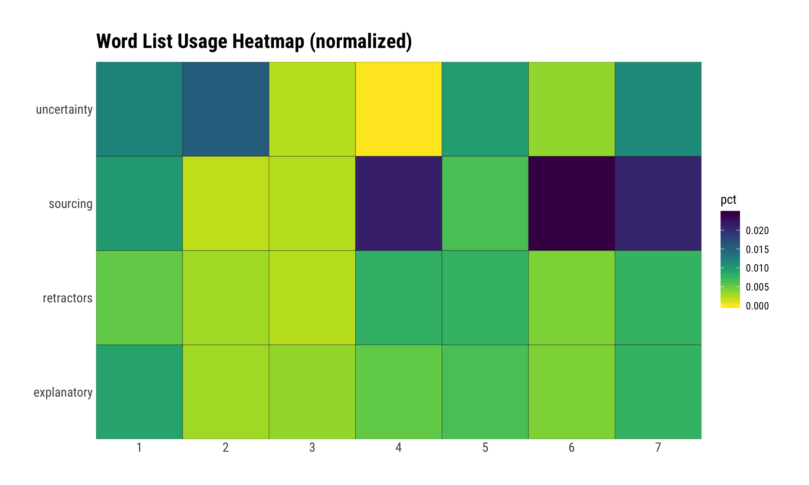

# Misinformation

Word lists and R code for analyzing media reporting that were used in
@PDXBek’s [Information Anarchy: A Survival Guide for the Misinformation
Age](https://www.sans.org/event/cyber-threat-intelligence-summit-2018/summit-agenda)
talk at the 2018 SANS Cyber Threat Intelligence
    Summit.

## What’s Inside The Tin

    ├── 00-prep.R                              docx to txt conversion via pandoc
    ├── 01-eda.R                               initial exploratory data analysis
    ├── 02-explanatory.R                       analysis of 'explanatory' words
    ├── 03-retractors.R                        analysis of 'retractor' words
    ├── 04-sourcing.R                          analysis of 'sourcing' words
    ├── 05-uncertainty.R                       analysis of 'uncertainty' words
    ├── 06-overall-normalized-comparison.R     normalized cross-sentiment comparison
    ├── lists                                  "sentiment" word lists for the analyses
    └── source-docs                            source documents for the analysis

Each R source file can be run like a normal script, but have specially
formatted comments that make it possible to “knit/spin” them into
self-contained HTML reports via [RStudio](https://www.rstudio.com/).
RStudio users can open up the included `misinformation.Rproj` project to
get started.

The “sentiment” n-gram lists used are in the `lists` directory and the
source news documents are in `source-docs`. There is no need to run the
prep script as the `docx` files have already been converted to
plaintext.

While each list can be analyzed independently, a normalized heatmap view
can be created with the `06-overall-normalized-comparison.R` script (the
output of which is below).

ID to Document Name Mapping

| doc\_id                        | doc\_num | total\_words |
| :----------------------------- | -------: | -----------: |
| CNET - How US cybersleuths dec |        1 |        1,327 |
| CNN - DNC hack                 |        2 |        1,024 |
| IVN - CNN Covering For DNC Cor |        3 |          880 |
| Red Nation- FBI Didn’t Analyze |        4 |          377 |
| The Nation - A New Report Rais |        5 |        5,119 |
| VOA- Think Tank- Cyber Firm at |        6 |        1,430 |
| WaPo - DNC hack                |        7 |        1,694 |

